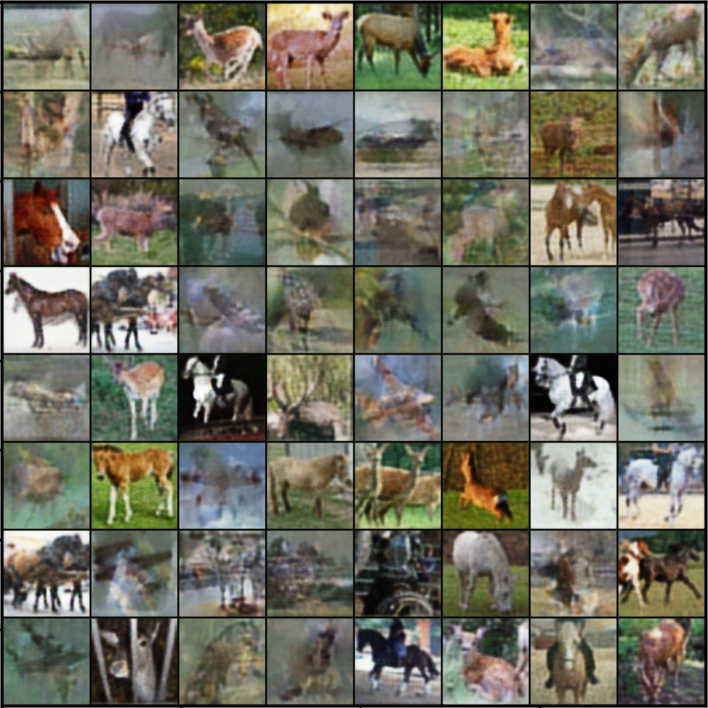
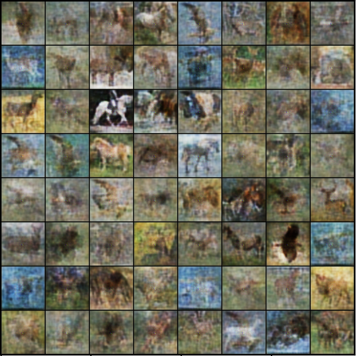

# DLRL Coursework

## Deep Learning

### Abstract from my report:

This paper proposes using a GLO model to generate images that look like a Pegasus. This model uses a basic generator architecture along with the Laplacian loss function, an informative loss equation which helps at a range of image resolutions. Then, we map each image to a point on the n-dimensional spherical latent space, acting as our probability distribu- tion. Using this spherical distribution, we examine the latent space between horses and birds with the intention of generating a smooth interpolation of the two images.

### Comments:
I quickly learned however that this model was not able to produce high quality samples as the space between image latents was not meaningful. 
For example see below the high quality reconstructions vs low quality interpolations:

| Image | Info |
| ------------- | ------------- |
|   | Best Image Reconstruction  |
|   | Best Image Interpolation  |

## Reinforcement Learning
